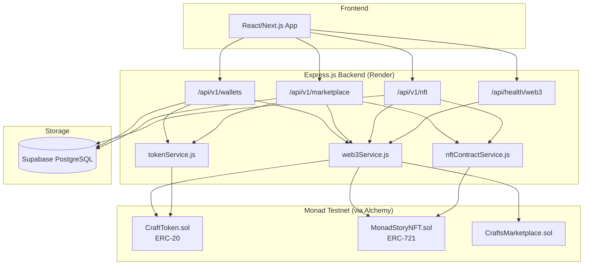
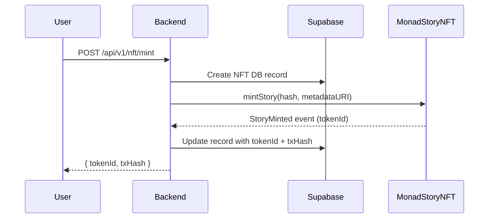
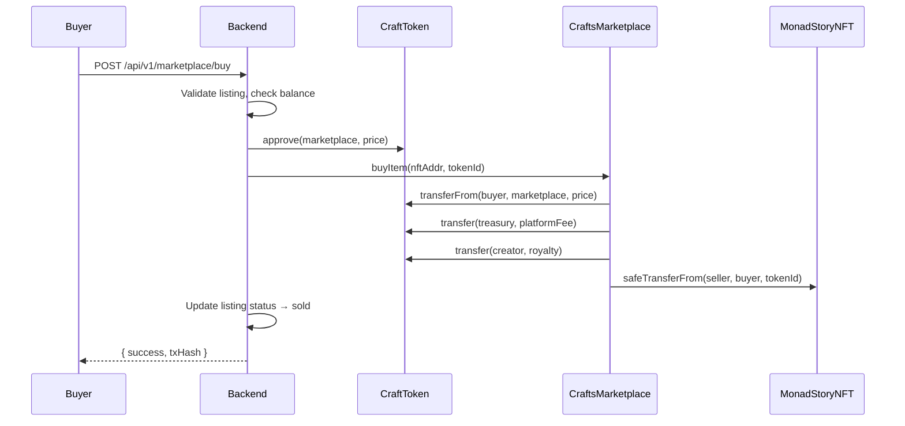

# Web3 Architecture — GroqTales / ComicCrafts

## Overview

GroqTales extends its storytelling platform with on-chain infrastructure on **Monad testnet**, using **CRAFTS** (ComicCraft Tokens) as the marketplace currency.

## Architecture



## Contract Interaction Flows

### Minting a Story NFT



### Buying from Marketplace



## Environment Variables

| Variable | Description | Example |
|---|---|---|
| `MONAD_RPC_URL` | Alchemy Monad testnet RPC | `https://monad-testnet.g.alchemy.com/v2/KEY` |
| `MONAD_CHAIN_ID` | Monad testnet chain ID | `10143` |
| `ALCHEMY_API_KEY` | Alchemy API key | `your-key` |
| `PLATFORM_SIGNER_KEY` | Server-side wallet private key | `0x...` |
| `PLATFORM_TREASURY_ADDRESS` | Fee collection wallet | `0x...` |
| `PLATFORM_FEE_PERCENT` | Marketplace fee (%) | `2.5` |
| `CRAFTS_TOKEN_ADDRESS` | Deployed CRAFTS ERC-20 | `0x...` |
| `STORY_NFT_CONTRACT_ADDRESS` | Deployed MonadStoryNFT | `0x...` |
| `CRAFTS_MARKETPLACE_ADDRESS` | Deployed CraftsMarketplace | `0x...` |

## Deploying Contracts

```bash
cd smart_contracts
npx hardhat deploy --network monad_testnet --tags crafts       # CraftToken
npx hardhat deploy --network monad_testnet --tags crafts-marketplace  # CraftsMarketplace
```

After deployment, set the contract addresses in your Render environment variables.

## Mainnet Migration Checklist

1. **Audit contracts** — CraftToken and CraftsMarketplace should be audited before mainnet
2. **Cap token supply** — Replace `onlyOwner` mint with a max-supply mechanism
3. **KMS for signer** — Move `PLATFORM_SIGNER_KEY` to AWS KMS / GCP Cloud HSM
4. **Gas strategy** — Implement dynamic gas pricing and retry policies
5. **Monitoring** — Add on-chain event listeners for real-time marketplace activity
